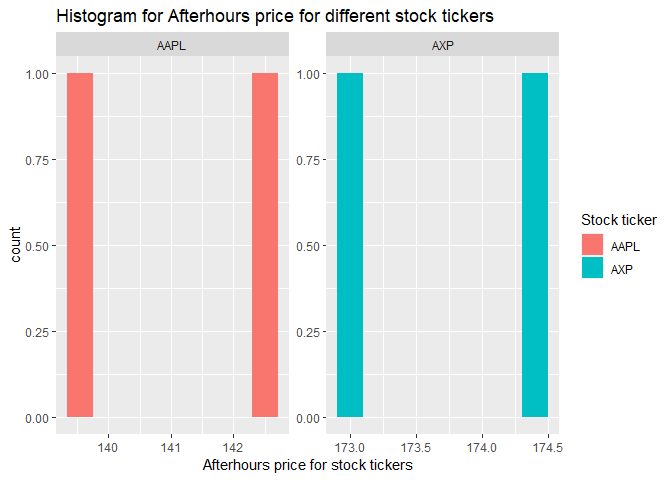
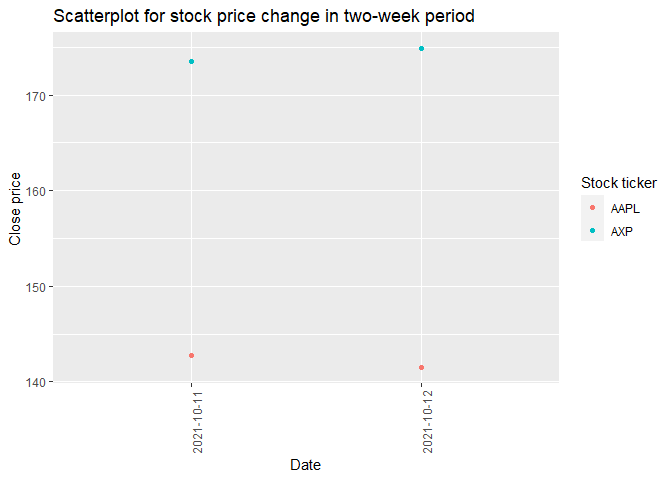
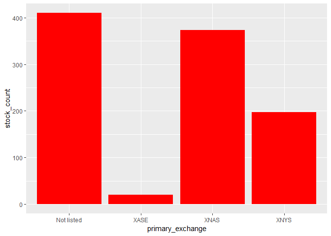

ST558 Project 2 Interacting with APIs: Example with the Financial API
================
Xi Zeng, Madhur Jiwtani
2022-10-06

# Introduction

This document is a vignette to show how to retrieve data from an API. In
this project, we will be interacting with the API for financial data.
Also, we will build a few functions to interact with some of the
endpoints as well as retrieve data to perform a basic exploratory data
analysis.

# Requirements

To use the functions for interacting with the Financial API, here are
some packages needed:  
- `tidyverse`: Collections of packages with useful functions for data
manipulation and visualization  
- `jsonlite`: Package needed to interact with API and parse data  
- `httr`: Used for load the data we need from API

# API Interaction Functions

Below are the part for the self-defined functions to interact with the
Financial API, as well as some instructions for the helper functions.

## ConstructURL

This function is for interacting with the `Daily Open/Close` endpoint
for the Financial API to acquire open,close and after hours prices of a
stock symbol on a certain date. For this function, user can specify the
stock ticker. It has to be accurate sticker letters, but case does not
matter in the input. Also, for date, we accept following formats:  
+ `%m/%d/%Y`  
+ `%m-%d-%Y`  
+ `%Y/%m/%d`  
+ `%Y-%m-%d`  
For the input variable`adjusted`, it means whether or not the results
are adjusted for splits. Here, the default will be the results are
adjusted, but user can self define it as well.

``` r
#Load the library needed for the function
library(tidyverse)
library(httr)
library(jsonlite)
library(shiny)
#rm(list = ls())

#Example for getting the data we want.
#Mydata <- GET("https://api.polygon.io/v1/open-close/AAPL/2020-10-14?adjusted=true&apiKey=pxkABpfvwGyIl55tOWtNxricS6IwKFYH")
#parsed <- fromJSON(rawToChar(Mydata$content))

#Construct API
ConstructURL <- function(stockticker, date, adjusted = "true"){
  BasicURL <- "https://api.polygon.io/v1/open-close"
  apikey <- "pxkABpfvwGyIl55tOWtNxricS6IwKFYH"
  #Transform the stockticker to the upper case
  newstockticker <- toupper(stockticker)
  
  #Transform the adjusted to lower case
  newadjusted <- tolower(adjusted)
  
  #Transform date to YY-MM-DD format
  date_format <- c("%m/%d/%Y","%m-%d-%Y","%Y/%m/%d","%Y-%m-%d")
  newdate <- format(as.Date(date, tryFormats = date_format), "%Y-%m-%d")
  
  #Get the new URL for requiring data
  newURL <- paste0(BasicURL,"/",newstockticker,"/",newdate,"?","adjusted=",newadjusted,"&apiKey=",apikey)
  
  #Require data with functions in httr package
  data <- GET(newURL)
  
  #Parse the data to get the data we want to retrieve 
  parsed <-fromJSON(rawToChar(data$content))
  
  #Tranform the data into data frame
  parsed <- as.data.frame(t(unlist(parsed)))
  return(parsed)
}
#Test if the function works
#ConstructURL(stockticker = "AApl",date = "2021/10/29")
```

## Market

This function is for interacting with the Tickers endpoint. It can be
used to query all the different type of market like “Stocks”, “Crypto”,
“FX” and “OTC” which are supported by this Financial API. The columns of
data the user will be getting will be different for each market type.

``` r
library(tidyverse)
library(httr)
library(jsonlite)

Market<-function(endpoints,type_of_market,limits){
baseUrl="https://api.polygon.io/v3/reference/"
endpoint=endpoints
api_key="Ha9q45MxKhMXoq7bPseOEPNpQ7XBpLoh"
market=type_of_market
limit=limits
targetUrl<-paste(baseUrl, endpoint, "?", "market", "=", market,"&limit=",limit,"&apiKey=",api_key,sep="")

tickerData <- GET(targetUrl)
parsedTickerData <- fromJSON(rawToChar(tickerData$content))
parsedTickerData$results$currency_name<-toupper(parsedTickerData$results$currency_name)
return(parsedTickerData$results)

}
#Market("tickers","fx",1000)
```

## Type_of_stock

This function is for interacting with the Tickers endpoint. It will help
the user to get a set of stocks and their information according to the
type of stock. The user gets the flexibility to either enter the
abbreviation or the full string of the type of stock and for that we
have done mapping using Ticker Detail API. User can also specify the
maximum number of stocks they want to see.

``` r
Type_of_Stock<-function(endpoints,type_of_stock,limits,abbreviation){
  if (!abbreviation)
    {
    tickerDetail<-GET("https://api.polygon.io/v3/reference/tickers/types?asset_class=stocks&apiKey=Ha9q45MxKhMXoq7bPseOEPNpQ7XBpLoh")
  parsedTickerDetail <- fromJSON(rawToChar(tickerDetail$content))
  result <- as_tibble(parsedTickerDetail$results)
  result <- result %>% filter(description == type_of_stock)
  type=as.character(result[,c("code")])
  }
  else{
    type=type_of_stock
  }
baseUrl="https://api.polygon.io/v3/reference/"
endpoint=endpoints
api_key="Ha9q45MxKhMXoq7bPseOEPNpQ7XBpLoh"
limit=limits
targetUrl<-paste(baseUrl, endpoint, "?", "type", "=", type,"&limit=",limit,"&apiKey=",api_key,sep="")

tickerData <- GET(targetUrl)
parsedTickerData <- fromJSON(rawToChar(tickerData$content))
parsedTickerData$results$currency_name<-toupper(parsedTickerData$results$currency_name)
parsedTickerData$results <- within(parsedTickerData$results, primary_exchange[market == "otc"] <- "Not listed")
return(parsedTickerData$results)
}
#Type_of_Stock("tickers","Common Stock",1000,FALSE)  
```

## Exchange

This function is helpful in identifying the stocks and their information
listed on a certain exchange. We have used the exchange API to map the
exchange symbol with their name so that user gets the option to enter
the full name of the exchange if they don’t have the idea of the code
for a particular exchange. Here we have used Ticker endpoint.

``` r
Exchange<-function(endpoints,exchange,limits,abbreviation){
  if (!abbreviation)
    {
    exchangeDetail<-GET("https://api.polygon.io/v3/reference/exchanges?asset_class=stocks&apiKey=Ha9q45MxKhMXoq7bPseOEPNpQ7XBpLoh")
  parsedExchangeDetail <- fromJSON(rawToChar(exchangeDetail$content))
  result <- as_tibble(parsedExchangeDetail$results)
  result <- result %>% filter(name == exchange)
  finalExchange=as.character(result[,c("operating_mic")])
  }
  else{
    finalExchange=exchange
  }
baseUrl="https://api.polygon.io/v3/reference/"
endpoint=endpoints
api_key="Ha9q45MxKhMXoq7bPseOEPNpQ7XBpLoh"
limit=limits
targetUrl<-paste(baseUrl, endpoint, "?", "exchange", "=", finalExchange,"&limit=",limit,"&apiKey=",api_key,sep="")

tickerData <- GET(targetUrl)
parsedTickerData <- fromJSON(rawToChar(tickerData$content))
parsedTickerData$results$currency_name<-toupper(parsedTickerData$results$currency_name)
return(parsedTickerData$results)
}
#Sample for function call using Exchange function
#Exchange("tickers","XNYS",1000,TRUE)  
```

## Dividend

The Dividend function uses the dividends endpoint and help the user to
get the list of companies who have declared a dividend on a given date
and after that date. To extract the data the user to enter a date. User
has been given the flexibility to enter the date in four formats:

-   `%m/%d/%Y`  
-   `%m-%d-%Y`  
-   `%Y/%m/%d`  
-   `%Y-%m-%d`

We have used format() and as.Date() function to get the date into a
format that is similar to date in data frame.

``` r
Dividend<-function(endpoints,declaration_date){
  baseUrl="https://api.polygon.io/v3/reference/"
  endpoint=endpoints
  date_format <- c("%m/%d/%Y","%m-%d-%Y","%Y/%m/%d","%Y-%m-%d")
  newdate <- format(as.Date(declaration_date, tryFormats = date_format), "%Y-%m-%d")
  api_key="Ha9q45MxKhMXoq7bPseOEPNpQ7XBpLoh"
 
  targetUrl<-paste(baseUrl, endpoint, "?", "declaration_date", "=", newdate,"&apiKey=",api_key,sep="")
  dividend<-GET(targetUrl)
  dividendDetail <- fromJSON(rawToChar(dividend$content))
  answer<-dividendDetail$results%>%select("ticker","frequency","currency","pay_date")
  return(answer)
}

#Sample for function call using Dividend function
#Dividend("dividends","07-07-2022")
```

# Exploratory Data Analysis

## Data query

First Function Call:

Below is the part of function call for exploratory data analysis. In
this part, 30 function calls was made to pull the open, close and after
hours prices of several stocks(AAPL,AXP and AAL) between certain
date(10/11/2021 - 10/22/2021).Also, the data for these calls are
combined, the return object for the function will be a well-formatted
data frame.

``` r
#Pull data from API for several stocktickers and a specific period of time.

#Set the stockticker for query
stockticker_call <- c("aapl","axP","AAL")

#Set the time frame for query
date_call <- c("10/11/2021","10/12/2021","10/13/2021",
               "10/14/2021","10/15/2021","10-18-2021",
               "10-19-2021","10-20-2021","10-21-2021","10-22-2021")

#Define count number for setting system sleep time because of the limits of API query.
count = 0

#Call the ConstructURL once to set a data frame
data_pull <- ConstructURL("aapl","10/11/2021")

#Conduct a nested loop for querying data
  for (i in stockticker_call){
    for (j in date_call){
      data_call <- ConstructURL(i,j)
      data_pull <- rbind(data_pull,data_call)
      count = count + 1
      if (count == 4) {
        count = 0
        Sys.sleep(61)
      }
    }
  }


#Delete the first row and keep what we need
data_pull = data_pull[-1, ]
```

Second Function Call:

This function will extract information about companies which offer
common stocks across different markets and exchanges.

``` r
stockdata<-Type_of_Stock("tickers","Common Stock",1000,FALSE)
```

## Data Manipulation

Below is part for create new variables. Here, a new variable change is
created which records the change price of the stock ticker from open
time to close time. Also a new categorical variable ’summary’is created,
it indicates if the stock price rises or declines at the date. If the
`change` variable is greater than 0, indicates the stock price rises at
that specific date, vice versa. If `change` is equal to 0, then it
indicates that the stock price remain the same for that day.

``` r
data_pull <- tibble(data_pull)

#Create a new variable change as well as a categorical variable summary 
newdata <- data_pull %>% mutate(change = as.numeric(close) - as.numeric(open),
                                summary = ifelse(change > 0, "rise",
                                                 ifelse(change < 0, "decline", "same")))
newdata
```

This part is for creating a new variable named `mean_volume`, which
summarizes the mean value of `volume` given the specified two-week
period for the three “AAL”, “AAPL”,“AXP” tickers.

``` r
#In this part, the mean volume for each stock ticker is summarized
 a <- data_pull %>%
        group_by(symbol)%>%
         summarise(mean_volume = mean(as.numeric(volume)))
a
```

    ## # A tibble: 3 × 2
    ##   symbol mean_volume
    ##   <chr>        <dbl>
    ## 1 AAL      26832118 
    ## 2 AAPL     69367247.
    ## 3 AXP       3304119

In this part, the above data with new variables created is utilized to
create contingency table. The table displays the frequency of the stock
price status(rise or decline) for each stock ticker.

``` r
table(newdata$summary,newdata$symbol)
```

    ##          
    ##           AAPL AXP
    ##   decline    1   1
    ##   rise       1   1

According to the table generated, in the specific time period(Includes
the week of 10/11/2021 and the week of 10/18/2021), the stock price for
AAL declines for 7 days and rises for 3 days. The stock price for AAPL
declines for 3 days and rises for 7 days. The stock price for AXP
declines for 4 days and rises for 6 days.

A second frequency table is created by the data pulled from the Tickers
endpoint. The table shows the frequency count of the primary exchange
for a particular type of market having common stocks.

``` r
stockdata$market <- as.factor(stockdata$market)
stockdata$primary_exchange <- as.factor(stockdata$primary_exchange)
marker_exchange <- table(stockdata$market, stockdata$primary_exchange)
marker_exchange
```

    ##         
    ##          Not listed XASE XNAS XNYS
    ##   otc           410    0    0    0
    ##   stocks          0   20  373  197

The table shows there are 20 stocks listed on XASE exchange, 373 on XNAS
and 197 on XNYS exchange, OTC stock are not listed and there are 410 OTC
stocks in the list demanded by the user based on Common Stock.

## Graphs

In this part, we are going to generate multiple graphs for exploratory
analysis of the data. And each graph will contains the interpretation
for it below the graph.

### Barplot

``` r
newdata
```

    ## # A tibble: 4 × 12
    ##   status from   symbol open  high  low   close volume after…¹ preMa…² change summary
    ##   <chr>  <chr>  <chr>  <chr> <chr> <chr> <chr> <chr>  <chr>   <chr>    <dbl> <chr>  
    ## 1 OK     2021-… AAPL   142.… 144.… 141.… 142.… 63952… 142.59  142.05   0.540 rise   
    ## 2 OK     2021-… AAPL   143.… 143.… 141.… 141.… 73035… 139.63  142.3   -1.72  decline
    ## 3 OK     2021-… AXP    175.… 176.… 173.… 173.… 24959… 173     174.05  -2.33  decline
    ## 4 OK     2021-… AXP    173.… 176.… 173.1 174.… 30695… 174.4   173.44   1.30  rise   
    ## # … with abbreviated variable names ¹​afterHours, ²​preMarket

``` r
g <- ggplot(data = newdata, aes(x = summary))
g + geom_bar(aes(fill = symbol), position = "dodge")+
  labs(x = "Summary of the stock Price", fill = "Stock ticker")+
  ggtitle("Barplot for the summary for different stock ticker")
```

<!-- -->

Above is the barplot for summarising the `summary` variable in the
dataset, it shows the frequency count for rise and decline of each stock
ticker.It seems that AAPL has a better stock performance at this time
period, the stock price of AAL seems to be declining most of the time.

### Histogram

``` r
ggplot(newdata,aes(x = as.numeric(afterHours),fill = symbol))+
  geom_histogram(bins = 8) + facet_wrap(~ symbol,scales = "free") +
  labs(x = "Afterhours price for stock tickers", fill = "Stock ticker")+
  ggtitle("Histogram for Afterhours price for different stock tickers")
```

<!-- -->

According to the histogram above, the after-hour stock price for AAL is
most around 19 to 20.5, and the after-hour stock price for AAPL is most
around 140 to 150, the after-hour stock price for AXP is most around
165-187.5 for the two weeks of time, shows a relative large price change
comparing to other two stock ticker.

### Boxplot

``` r
g <- ggplot(newdata,aes(symbol,change))
g + geom_boxplot(fill = "orange")+
  labs(x = "Stock tickers", y = "Stock price change per day ")+
  ggtitle("Boxplot for stock price change for specific stock ticker")
```

<!-- -->

According to the boxplot above, the stock price change is more stable
for AAL, the price change for AXP shows bigger variance. Also, it seems
that the mean value for stock price change for AAPL and AXP is bigger
than 0, meaning that in the two-week period, the stock price for AAPL
and AXP rises comparing to 10/11/2021.

### Scatterplot

``` r
#newdata
g <- ggplot(newdata, aes(x = from,  y = as.numeric(close), color = symbol))
g + geom_point()+labs(x = "Date", y = "Close price ", color ="Stock ticker")+
  ggtitle("Scatterplot for stock price change in two-week period") +
  theme(axis.text.x = element_text(angle = 90))
```

<!-- -->

According to the boxplot above, AAL has lowest stock price, then AAPL,
and AXP have the largest closing price. Also, AXP and AAPL shows a
slightly upward change in the scatter plot.

### Extra boxplot

``` r
g <- ggplot(newdata,aes(symbol,as.numeric(volume)))
g + geom_boxplot(fill = "green")+ geom_point(aes(color = symbol),position = "jitter") +
  labs(x = "Stock tickers", y = "Volume", color = "Stock ticker")+
  ggtitle("Figure for volume for specific stock ticker")
```

<!-- -->

According to the boxplot above, the close price for AXP is the lowest.
Also, it has lowest variance. On the other hand, AAPL has highest close
price, also with largest variance.

### Extra barplot

``` r
data_1<- stockdata %>% count(primary_exchange)
barplot <- ggplot(data = data_1, aes(primary_exchange, n)) + labs(y = "stock_count") + geom_bar(stat = "identity", fill = "red")
barplot
```

<!-- --> This barplot
shows that the XASE exchange has the lowest number os Common stocks
listed on it, while XNAS has the highest number of stock listed. It also
shows that a large number of common stocks are not listed and are traded
over the counter

This is the code to render the README file.

``` r
library(rmarkdown)
rmarkdown::render(input = "ST558_Project_2.Rmd",
                  output_format = "github_document",
                  output_file = "README.md")
```
